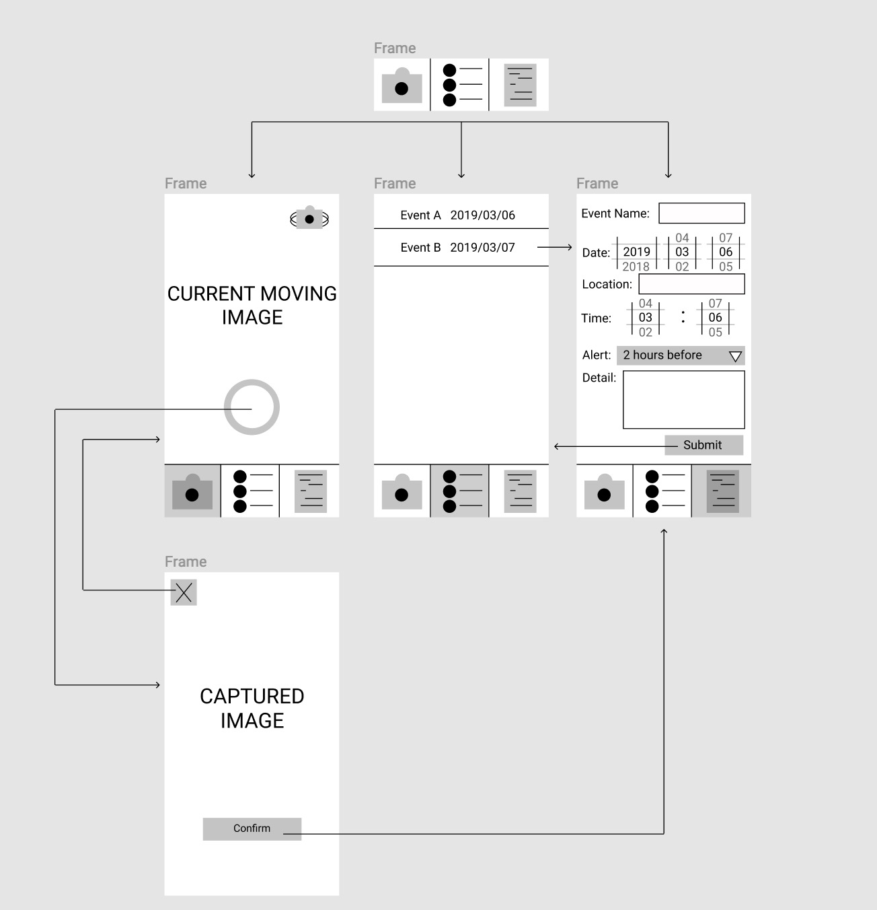

# EventScan

## Table of Contents
1. [Overview](#Overview)
1. [Product Spec](#Product-Spec)
1. [Wireframes](#Wireframes)
1. [Schema](#Schema)


## Overview
### Description
Use the Captured Image and OCR library to Scan information, and create event on calender base on it.
   - **Category:** Photo & Calendar
   - **Mobile:** Uses camera, mobile only experience.
   - **Story:** Allows users to manage their schedule through pictures.
   - **Market:** Anyone use camera to store detailed information about the event. 
   - **Habit:** Users can create event throughout capturing the image or directly entering the information.
   - **Scope:** Capturing image, scanning the words from the image, manipulate the information, create the event. 
   
## Product-Spec
### 1. User Stories (Required and Optional)

**Required Must-have Stories**

 * Display upcoming events    
 * Scan flyers
     * Be able to view the camera
     * Be able to use OCR
     * Take the picture first and then process the information 
 * Add the event to the user's calender app
 * Ask for alert preferences for the event
 * Be able to verify the event before adding it to the calender.

**Optional Nice-to-have Stories**

 * User Onboarding 
 * Ability to invite other users to the scanned event
 * Setup default alert times  i.e "At time of event" 
 * Be able to edit the newly scanned event in case the parsing algorithm failed
 * Detail Even View for upcoming events

### 2. Screen Archetypes

 * Camera View 
 	- The user can take a picture of a flyer to be parsed by the app.
 * Image Confirmation View
 	- The user is presented with the picture they captured using the camera view. If they feel that the image captured contains all the inofrmation that they wish to inlclude in their calendar event, else they may rescan it.
 * Upcoming Events Screen
 	- It shows the user the closet events in their calendar that have been created using the app.
 * Event details screen
     - Once the information that event has been parsed, it is displayed to the user so they make some modifcations to the event if they wish to do so.

### 3. Navigation

**Tab Navigation** (Tab to Screen)

 * Camera View 
 	- The user uses the camera view to take a picture and create an event.
 * Upcoming Events
 	- The upcoming events view is where the user would go to view their upcoming events.
 * Manually enter an event (optional)
 	-  This can be a view for the users to create events manually using the application via the event detail view.

**Flow Navigation** (Screen to Screen)

 * Camera View
     => Image Confirmation View
     => Events Detail View
 * Upcoming Events
     => Events Detail View

## Wireframe
<br>


## Schema 
### Models
#### Post

   | Property      | Type     | Description |
   | ------------- | -------- | ------------|
   | objectId      | String   | unique id for the user post (default field) |
   | author        | Pointer to User| image author |
   | image         | File     | image that user posts |
   | caption       | String   | image caption by author |
   | commentsCount | Number   | number of comments that has been posted to an image |
   | likesCount    | Number   | number of likes for the post |
   | createdAt     | DateTime | date when post is created (default field) |
   | updatedAt     | DateTime | date when post is last updated (default field) |
### Networking
#### List of network requests by screen
   - Home Feed Screen
      - (Read/GET) Query all posts where user is author
         ```swift
         let query = PFQuery(className:"Post")
         query.whereKey("author", equalTo: currentUser)
         query.order(byDescending: "createdAt")
         query.findObjectsInBackground { (posts: [PFObject]?, error: Error?) in
            if let error = error { 
               print(error.localizedDescription)
            } else if let posts = posts {
               print("Successfully retrieved \(posts.count) posts.")
           // TODO: Do something with posts...
            }
         }
         ```
      - (Create/POST) Create a new like on a post
      - (Delete) Delete existing like
      - (Create/POST) Create a new comment on a post
      - (Delete) Delete existing comment
   - Create Post Screen
      - (Create/POST) Create a new post object
   - Profile Screen
      - (Read/GET) Query logged in user object
      - (Update/PUT) Update user profile image
#### [OPTIONAL:] Existing API Endpoints
##### An API Of Ice And Fire
- Base URL - [http://www.anapioficeandfire.com/api](http://www.anapioficeandfire.com/api)

   HTTP Verb | Endpoint | Description
   ----------|----------|------------
    `GET`    | /characters | get all characters
    `GET`    | /characters/?name=name | return specific character by name
    `GET`    | /houses   | get all houses
    `GET`    | /houses/?name=name | return specific house by name

##### Game of Thrones API
- Base URL - [https://api.got.show/api](https://api.got.show/api)

   HTTP Verb | Endpoint | Description
   ----------|----------|------------
    `GET`    | /cities | gets all cities
    `GET`    | /cities/byId/:id | gets specific city by :id
    `GET`    | /continents | gets all continents
    `GET`    | /continents/byId/:id | gets specific continent by :id
    `GET`    | /regions | gets all regions
    `GET`    | /regions/byId/:id | gets specific region by :id
    `GET`    | /characters/paths/:name | gets a character's path with a given name

